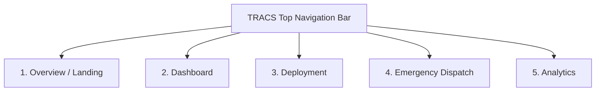

# Implementation Plan: TRACS Multi-Tab Control Room Frontend

This plan outlines the front-end implementation of the **TRACS (Traffic Response & Control System)** Web Application inside `d:\Hackathon\frontend`. The design directly mirrors the 4 provided reference screenshots while incorporating team review feedback.

---

## 🎨 Design System & Theme Alignment

Based on the reference screenshots:
- **Style:** Modern Enterprise SaaS / Clean Light Slate Theme (`#f8fafc` background, `#ffffff` cards with crisp `1px solid #e2e8f0` borders and soft shadows).
- **Brand Accent:** TRACS Royal Blue (`#2563eb`).
- **Typography:** `Outfit` (Headings) and `Inter` (Body & UI text).
- **Status Colors:**
  - 🔴 **High / Critical Risk:** `#ef4444` (Vibrant Red) with `#fee2e2` soft badges.
  - 🟡 **Medium Risk:** `#f59e0b` (Amber Orange) with `#fef3c7` soft badges.
  - 🟢 **Low Risk:** `#10b981` (Emerald Green) with `#d1fae5` soft badges.

---

## 🏛️ Views & Navigation Structure

The application will feature a top navigation bar with **5 dedicated views**:



### 1. 🏠 Overview (Landing / System Explanation)
- **Hero Banner:** *"CONTROL TRAFFIC. RESPOND FASTER."* with CTA buttons (`Enter Control Room`, `Explore System`).
- **4 Feature Cards:** Traffic Congestion, High-Risk Junctions, Limited Resources, Slow Response.
- **4-Step Process:** 01 Monitor ➔ 02 Analyze ➔ 03 Deploy ➔ 04 Compare.
- **Live System Teaser:** Quick map preview & police deployment snapshot cards.

### 2. 📊 Dashboard (Current Traffic Conditions) — *Image 2 Reference*
- **Teammate Feedback Addressed:** *"Current traffic Conditions wala jo hai na usme dekh Heavy,moderate and light traffic sbkuch ek hi row mai messy lg rha use na traffic wise rows mai divide kr."*
  * **Solution:** Instead of a single mixed grid, traffic condition cards will be organized into **3 distinct, categorized rows**:
    1. 🔴 **Heavy Traffic (Critical Risk)** Row
    2. 🟡 **Moderate Traffic** Row
    3. 🟢 **Light Traffic** Row
- **Selected Junction Detail Drawer (Bottom Left):** Shows officer deployment donut chart (e.g. 75%), 24-hour traffic flow line chart, and 7-day incident history timeline.
- **Right Sidebar Panels:** Overall Analytics Donut Chart (High/Medium/Low breakdown) & Ranked Top 5 High-Risk Junctions progress bars.

### 3. 👮 Deployment (Officer Allocation) — *Image 3 Reference*
- **Available Officers Summary Cards:** Total Officers (73), Currently Deployed, Available, High Priority Available.
- **Junctions Needing Officers Grid:** Cards showing junction location, risk score badge, current vs recommended officers, and an interactive **`[ Deploy Officer ]`** button.
- **Right Sidebar:** Deployment summary counts & quick risk stats.
- **Recent Deployment Activity Table:** Real-time audit log of officer movements with timestamps, action tags, officer IDs, and locations.

### 4. 🚑 Emergency Dispatch (Ambulance Showcase) — *Unique Highlight Requirement*
- **Teammate Feedback Addressed:** *"uniqueness abt ambulance and all woh bhi showcase krna pdega. Otherwise sb AI se generate krenge toh aisa na ho ki similar hi rhe"*
  * **Solution:** A dedicated showcase view for emergency responders (Ambulances & Fire Engines).
  * **Interactive Routing Map:** Select emergency vehicle type, origin, and destination.
  * **Dijkstra Pathfinding:** Renders a glowing cyan route on Leaflet, calculating distance and travel time.
  * **Before vs After Routing Comparison:** Shows time saved by routing around traffic jams vs standard GPS route (e.g. 14.3 min vs 28.1 min — 49% time saved).

### 5. 📈 Analytics (Deployment Impact Analysis) — *Image 1 Reference*
- **Header:** Date picker filter & "Comparing traffic conditions and risk levels before and after TRACS deployment".
- **Junction Condition Comparison Table:** Shows Junction, Before (Critical 85), After (Moderate 42), and Improvement indicator.
- **City-Wide Risk Level Comparison Chart:** Grouped bar chart comparing junction counts before (blue) vs after (green) across Critical, High, Moderate, Low.
- **Key Impact Summary Cards:** Average Risk Reduction (48.5%), High-Risk Junctions Reduced (12 ➔ 4), Officer Coverage Improvement (41.2%), Response Time Improvement (31.6%).
- **Dual Heatmap View:** Side-by-side maps showing **Before Deployment** vs **Projected After Deployment**.

---

## 📁 File Structure in `d:\Hackathon\frontend\`

```
d:\Hackathon\frontend\
  ├── index.html        # Main HTML layout with SPA view containers
  ├── styles.css        # TRACS light slate design system, CSS grid, cards, charts
  ├── app.js            # SPA view router, Leaflet map renderer, Chart.js integrations, API calls
  └── README.md         # Documentation for running & presenting the frontend
```

---

## 🧪 Verification Plan

### Automated / Browser Verification
1. Run backend server at `http://127.0.0.1:8000`.
2. Open `http://127.0.0.1:8000/demo/` or `d:\Hackathon\frontend\index.html` in browser.
3. Test view switching between `Overview`, `Dashboard`, `Deployment`, `Emergency Dispatch`, and `Analytics`.
4. Verify that:
   - Traffic cards are categorized into Heavy, Moderate, Light rows on the Dashboard.
   - The Emergency Dispatch route finder draws Dijkstra routes on Leaflet and displays ETA savings.
   - Deploy buttons update officer counts live via `POST /api/allocate` and `POST /api/override`.
